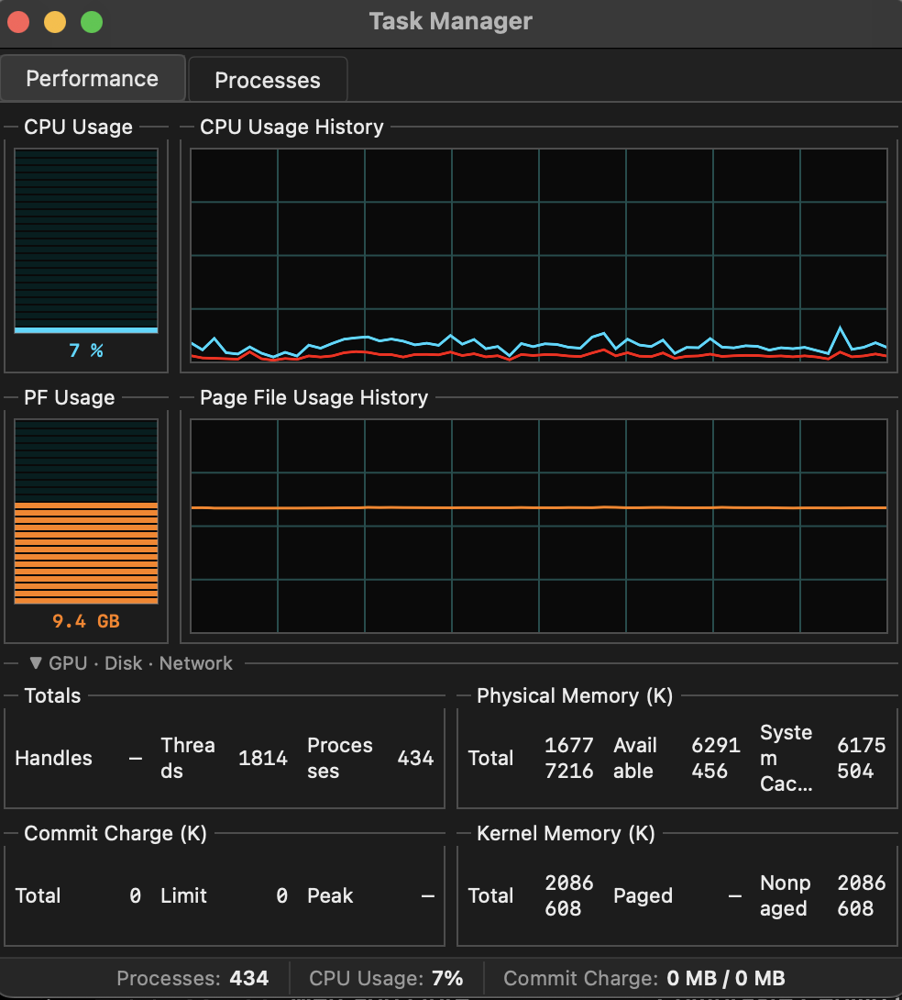
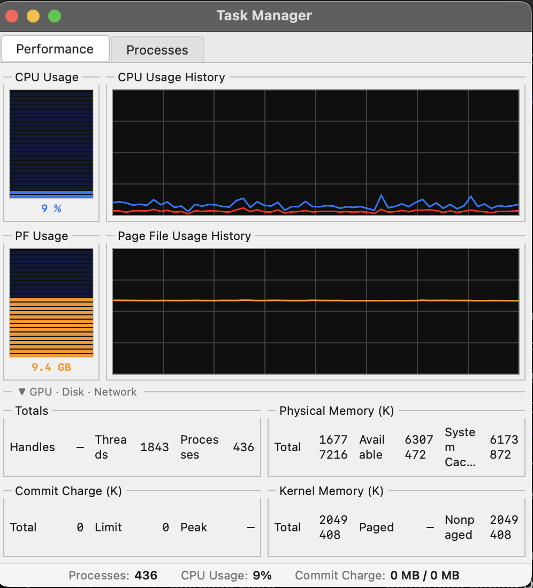
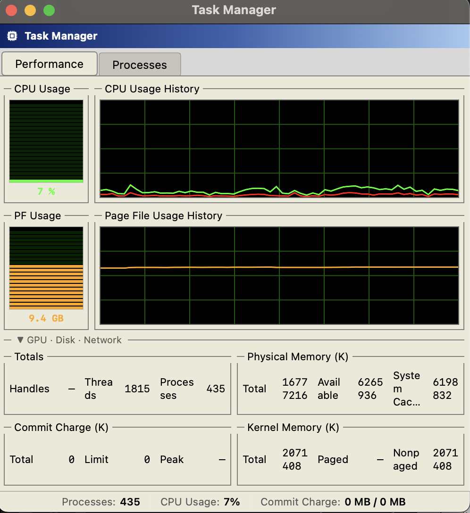

# Task Manager 📊

> **Inspired by Windows XP Task Manager** — A native system monitor for macOS

---

## 🌍 English

### About

Task Manager is a native system monitor for macOS, inspired by the iconic Windows XP Task Manager. Visualize in real-time the performance of your Mac: CPU, memory, disk, network, and active processes.

**This is free software.** If you find it useful and want to support the development, consider [buying me a coffee ☕](https://ko-fi.com/juangui)

### Features

- ⚡ **Real-time monitoring** — CPU, Page File, GPU, Disk, Network
- 📈 **Historical graphs** — Track resource behavior over time
- 🎨 **3 themes** — Dark, Light, and Windows XP style (for nostalgia)
- 📋 **Process manager** — Detailed list of active processes
- 🔍 **Advanced statistics** — Physical memory, Cache, Kernel Memory, etc.
- ⚡ **Lightweight and fast** — Native macOS interface with minimal resource usage

### Requirements

- **macOS** 10.13 or later
- **Processor** Intel or Apple Silicon (M1/M2/M3+)
- **RAM** minimum 512 MB available
- **Storage** ~50 MB

### Installation

1. Download the latest version from [Releases](https://github.com/jupobleteb/task-manager-pub/releases)
2. Open `Task Manager.dmg`
3. Drag **Task Manager** to the **Applications** folder
4. Open from Applications or press `Cmd + Space` and type "Task Manager"

> **Note:** macOS may ask for permission on first launch. Grant access in System Preferences → Security & Privacy.

### Usage

#### Performance Tab
- **CPU Usage** — Current CPU usage percentage
- **CPU Usage History** — Historical graph of recent hours
- **PF Usage** — Memory paging (Page File) in GB
- **Page File History** — Memory usage trend

#### Processes Tab
- Complete list of active processes
- Sort by CPU, memory, or other resources
- Safely terminate problematic processes

#### Available Themes
Change the theme in preferences:
- **Dark** — Perfect for dark environments (OLED friendly)
- **Light** — Clean and classic
- **XP** — Retro Windows XP style theme

### FAQ

**Do I need an internet connection?**
No, Task Manager works completely offline.

**Does it drain battery?**
No, it's optimized for low CPU and battery consumption.

**Is it safe?**
Yes, completely. It only accesses public system statistics. No personal data is collected.

**Can I close system processes?**
Yes, but it's recommended to only close user applications. System processes are clearly marked.

### Report Bugs

Found an issue? Open a bug report on [GitHub Issues](https://github.com/jupobleteb/task-manager-pub/issues) with:
- macOS version
- Mac model (Intel / M1 / M2 / etc.)
- Steps to reproduce
- Screenshots if applicable

### Support

If you love Task Manager and want to support its development:

**[☕ Buy me a coffee](https://ko-fi.com/juangui)**

Your support helps keep this project alive!

---

## 🇪🇸 Español

### Acerca de

Task Manager es un monitor de sistema nativo para macOS, inspirado en el icónico Task Manager de Windows XP. Visualiza en tiempo real el rendimiento de tu Mac: CPU, memoria, disco, red y procesos activos.

**Este es software gratuito.** Si te resulta útil y quieres apoyar el desarrollo, considera [invitarme a un café ☕](https://ko-fi.com/juangui)

### Características

- ⚡ **Monitoreo en tiempo real** — CPU, Page File, GPU, Disco, Red
- 📈 **Gráficos históricos** — Sigue el comportamiento de tus recursos en el tiempo
- 🎨 **3 temas** — Oscuro, Claro, y estilo Windows XP (por nostalgia)
- 📋 **Gestor de procesos** — Lista detallada de procesos activos
- 🔍 **Estadísticas avanzadas** — Memoria física, Cache, Kernel Memory, etc.
- ⚡ **Ligero y rápido** — Interfaz nativa de macOS, sin consumir recursos

### Requisitos

- **macOS** 10.13 o superior
- **Procesador** Intel o Apple Silicon (M1/M2/M3+)
- **RAM** mínimo 512 MB disponible
- **Espacio** ~50 MB

### Instalación

1. Descarga la última versión de [Releases](https://github.com/jupobleteb/task-manager-pub/releases)
2. Abre el archivo `Task Manager.dmg`
3. Arrastra **Task Manager** a la carpeta **Applications**
4. Abre desde Applications o presiona `Cmd + Espacio` y escribe "Task Manager"

> **Nota:** Es posible que macOS pida permiso la primera vez. Autoriza el acceso en Preferencias del Sistema → Seguridad y Privacidad.

### Uso

#### Pestaña Performance
- **CPU Usage** — Uso actual de CPU en porcentaje
- **CPU Usage History** — Gráfico histórico de últimas horas
- **PF Usage** — Memory paging (Page File) en GB
- **Page File History** — Tendencia de uso de memoria virtual

#### Pestaña Processes
- Lista completa de procesos activos
- Ordena por CPU, memoria u otros recursos
- Cierra procesos problemáticos con seguridad

#### Temas disponibles
Cambia el tema en preferencias:
- **Dark** — Ideal para ambiente oscuro (OLED friendly)
- **Light** — Clásico y limpio
- **XP** — Tema retro estilo Windows XP

### Preguntas Frecuentes

**¿Necesito conexión a internet?**
No, Task Manager funciona completamente offline.

**¿Consume mucha batería?**
No, está optimizado para bajo consumo de CPU y batería.

**¿Es seguro?**
Completamente. Solo accede a estadísticas públicas de sistema. No recoge datos personales.

**¿Puedo cerrar procesos de sistema?**
Sí, pero es recomendable solo cerrar aplicaciones de usuario. Los procesos de sistema están claramente marcados.

### Reportar Bugs

¿Encontraste un problema? Abre un issue en [GitHub Issues](https://github.com/jupobleteb/task-manager-pub/issues) con:
- Versión de macOS
- Modelo de Mac (Intel / M1 / M2 / etc.)
- Pasos para reproducir
- Capturas de pantalla si aplica

### Apoya el Proyecto

Si te encanta Task Manager y quieres apoyar su desarrollo:

**[☕ Invítame un café](https://ko-fi.com/juangui)**

¡Tu apoyo mantiene este proyecto vivo!

---

## 📸 Screenshots

### Dark Mode

### Light Mode

### Full Layout

### XP Theme

---

## 📝 License

© 2026 Juan Pablo Obleteta. All rights reserved.

Task Manager is proprietary software. Copying, modifying, or distributing without explicit authorization from the author is not permitted.

---

**Version:** 1.0.0
**Last updated:** March 2026

Developed with ❤️ by [@jupobleteb](https://github.com/jupobleteb)

Download now and take full control of your Mac. 🚀
